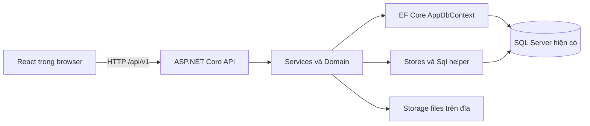

# Kiến trúc Soopi

Mô tả implementation hiện có ngày 02/10/2026. Các lựa chọn và ngoại lệ đã chốt nằm ở
[DECISIONS](DECISIONS.md); mapping Java/entity/bảng/trang nằm ở [MIGRATION_PLAN](../MIGRATION_PLAN.md).

## Luồng xử lý

Development: React chạy qua Vite 5173, proxy sang API 8080. Bản đóng gói: ASP.NET phục vụ React tại cùng origin.
React không giữ connection string hay kết nối SQL Server. URL API sai không fallback thành HTML.

## Backend

| Thư mục | Trách nhiệm |
|---|---|
| `Controllers/` | Route HTTP, nhận DTO/JSON/multipart, trả JSON hoặc tệp; không trả Thymeleaf |
| `DTOs/` | Hợp đồng auth/shared và dữ liệu request/response; một số record nằm cạnh controller/service |
| `Services/` | Use case, phân quyền, phối hợp transaction/audit/notification và lưu trữ |
| `Domain/` | Trạng thái phiếu/báo giá/chứng từ, vai trò/quyền, luật tiền/SĐT/serial/IMEI; test không DB |
| `Data/Entities/` | Entity EF map tên bảng/cột hiện có |
| `Data/Stores/` | Truy vấn/lưu dữ liệu theo module; phần lớn T-SQL được port từ Java |
| `Data/` | DbContext, helper SQL, transaction, mã tự sinh, giờ DB, dịch lỗi SQL |
| `Infrastructure/` | JWT/security middleware, JSON, validation, Problem Details và correlation ID |
| `Resources/` | Thông điệp lỗi và tài nguyên được nhúng |
| `wwwroot/` | Output React được Vite build, không phải source chỉnh tay |

`Program.cs` đăng ký DI và middleware. JWT xác thực trước security boundary và kiểm buộc đổi mật khẩu;
controller `[Authorize]`/endpoint công khai được phối hợp với kiểm quyền tại service bằng `CurrentActor`.
Frontend role guard phục vụ điều hướng, không thay thế quyền backend.

## Database và transaction

- Giữ database/schema SQL Server; không EF migration, `EnsureCreated`, seed hay chạy script DDL.
- EF map 7 bảng: `TaiKhoan`, `TaiKhoan_VaiTro`, `RefreshToken`, `KhachHang`, `ThietBi`, `HoaDon_PhieuThu`,
  `NhanVien` (chỉ cột phục vụ liên kết tài khoản). Các module còn lại dùng SQL/Stores.
- `Sql` dùng connection và transaction của `AppDbContext`, chuyển tham số `?` thành parameter;
  aggregate phiếu dùng update có điều kiện phiên bản, không EF tracking 9 bảng con.
- `TransactionRunner`: READ COMMITTED, thao tác lồng tham gia transaction ngoài; tối đa 3 lần thực hiện
  khi xung đột phiên bản/deadlock/lock timeout. Callback `AfterCommit` chạy sau commit.
- Timeout khóa 10 giây được áp vào lệnh EF/SQL. Aggregate/thông báo có thể đọc nhiều result set trong một lệnh.
- Code sinh mã vẫn sử dụng dữ liệu/bộ đếm hiện có. Không chạy thử sinh mã trong phiên chỉ đọc.

Chi tiết mapping và metadata 47 bảng/404 cột tại [báo cáo](MIGRATION_VERIFICATION.md).
Metadata là bằng chứng tên/cấu trúc đọc được, chưa chứng minh mọi constraint/SQL đúng trong luồng ghi.

## JSON, giờ và tiền

JSON camelCase, UTF-8; enum ghi tên. Deserializer giữ các coercion Jackson đã đối chiếu, tên field/enum
phân biệt hoa/thường, nhận ordinal enum hợp lệ. Input chuẩn cho client vẫn là đúng kiểu và tên enum.
Validation giữ thông điệp Bean Validation; lỗi HTTP dạng Problem Details có `code`, `correlationId`, `fieldErrors`.

Thời điểm API dùng UTC `…Z`; DB `DATETIME2(0)` lưu giờ Việt Nam (+07:00), không phần lẻ giây.
`Money.Round` dùng HALF_UP (`AwayFromZero`). Payment constructor giữ amount/scale;
EF read converter bỏ scale chỉ khi tiền nguyên, giữ tiền lẻ như Java `@PostLoad`.

`DateTimeOffset` có độ chính xác 100ns, `decimal` có miền giá trị hữu hạn; không tương đương mọi Instant/BigDecimal.
100 quan sát oracle chỉ xác nhận các case đã chạy, không chứng minh mọi input.

## Xác thực và phân quyền

JWT RS256, access 15 phút. Tài khoản có security version để vô hiệu hóa token sau thay đổi mật khẩu/quyền/khóa.
Mật khẩu cũ dạng `{bcrypt}` được giữ và kiểm bằng BCrypt; không dùng ASP.NET Identity vì không đổi schema.
Refresh token được hash SHA-256 trong DB, xoay vòng theo họ; web dùng cookie, mobile dùng JSON body.
Portal token 30 phút chỉ cấp quyền cho đúng một phiếu/yêu cầu, không refresh.

| Vai trò | Trang chính | Công việc chính |
|---|---|---|
| `ADMIN` | `/admin` | Tài khoản, vai trò và danh mục theo quyền |
| `RECEPTIONIST` | `/receptionist` | Khách/thiết bị, tiếp nhận, xử lý yêu cầu trực tuyến |
| `DISPATCHER` | `/dispatch` | Phân công, theo dõi phiếu, duyệt báo giá |
| `TECHNICIAN` | `/technician` | Chẩn đoán, báo giá, yêu cầu linh kiện, sửa chữa/QC phiếu được giao |
| `WAREHOUSE_KEEPER` | `/warehouse` | Linh kiện, nhập/xuất/điều chuyển kho |
| `CASHIER` | `/cashier` | Thu tiền/xác nhận miễn phí và bàn giao |
| `CUSTOMER` | `/portal` | Chức năng portal theo tài khoản hoặc token phạm vi |

Trang dùng chung `/tickets`, `/reports`, `/login`; quyền cụ thể gồm 39 permission trong
[`Roles.cs`](../backend-dotnet/src/Soopi.Api/Domain/Identity/Roles.cs), không suy từ tên vai trò rằng được gọi mọi API.
Thứ tự vai trò ưu tiên/landing giữ logic đã port.

## Frontend

10 trang TSX giữ markup và 3 CSS cũ. `src/behaviors` giữ các handler/bảng động JavaScript,
được runtime gắn trước paint để tránh form submit mặc định khi module đến chậm.
React Router quản lý route; điều hướng giữa trang tải lại tài liệu, tab giữ hash.
Đây là bridge hiện có, chưa chuyển toàn bộ bảng/state sang React hooks.

`src/behaviors/api.js` dùng `fetch`, base URL từ `VITE_API_BASE_URL`, credentials include;
gộp refresh khi nhiều request 401 đồng thời, xử lý portal token riêng và giữ lỗi validation cho form.
Link HTML cũ được dịch/redirect sang route React, không cập nhật dữ liệu thông báo cũ trong DB.

## Tệp và job nền

Nội dung tệp lưu dưới `Storage:Directory`, metadata/quyền sở hữu ở `TepDinhKem`.
Backup/khôi phục cần cả DB lẫn thư mục tệp; đổi storage phải bảo toàn relative key hiện có.
Không giả định tệp Java cũ tự được chuyển sang thư mục Soopi mới.

Job SLA định kỳ tạo thông báo; cleanup xóa refresh token hết hạn quá 7 ngày lúc 02:00 giờ Việt Nam.
SMS và push chỉ chế độ `log`; provider khác bị từ chối khi startup, chưa có email provider.
Chi tiết vận hành/kiểm chứng: [OPERATIONS](OPERATIONS.md).

Giai đoạn 4 còn chờ kiểm API có token và luồng ghi/concurrency trên DB được duyệt;
kiến trúc này chưa được nghiệm thu để thay hệ thống Java trong production.
